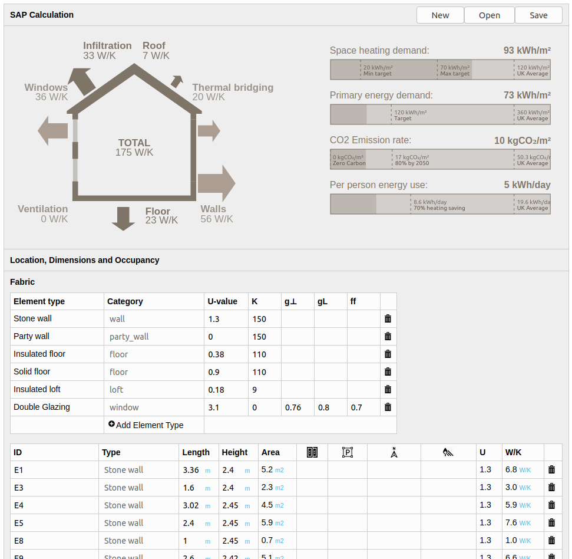

# SAPjs

A minimal user interface for the OpenBEM SAP model using Vue.js

Hello and welcome! This tool builds on previous work on a similar tool called [MyHomeEnergyPlanner](github.com/emoncms/MyHomeEnergyPlanner), both share the same core SAP model ([OpenBEM](github.com/trystanlea/openbem)). This tool is just a new user interface that focuses on input flexibility as well as pairing things right down to the basics. It is aimed at the enthusiast householder like myself who wants to do their own calculations and dig into the detail a bit more. To date this new user interface has been a personal project and while the tool is hosted at OpenEnergyMonitor I make no guarantees of ongoing support or regular development. It does the job for me and Im pretty happy with it, I hope you enjoy! If you would like to adapt or contribute back to this project please see the contributing section below. Cheers!

### Online tool

SAPjs is installed on the OpenEnergyMonitor server for public use here:

**https://openenergymonitor.org/sapjs/**

Save and open projects to your computer locally. Data is not stored on the OpenEnergyMonitor server, all calculations happen in your computer browser.
The OpenEnergyMonitor server is only used to initially load the tool.

### Self host or install locally

1\. Clone this repository into your public_html folder (assuming installed apache2 server):

    git clone https://github.com/TrystanLea/SAPjs
    
2\. Clone my fork of the OpenBEM SAP model inside the SAPjs directory:

    cd SAPjs
    git clone https://github.com/TrystanLea/openBEM
    
 3\. Thats it, open in browser via e.g: http://localhost/SAPjs
    
    
### Contributing 

Feel free to fork this project and adapt to your own requirements, the work is licenced under GPL Affero V3. 

If you would like to contribute back to the project please get in contact via the github issues to introduce yourself and discuss proposed changes before creating a pull request, that's if they are more than fixing typos and very small errors :)

A key goal for this project is to keep things simple and focus on input flexibility for the enthusiast user. I'm trying to avoid adding complexity such as libraries and backend systems for saving and managing projects.

The following contributing guide for normalize css is a great overview of how to contribute to an open source project and how to use git to create pull requests among other things.

https://github.com/necolas/normalize.css/blob/master/CONTRIBUTING.md

