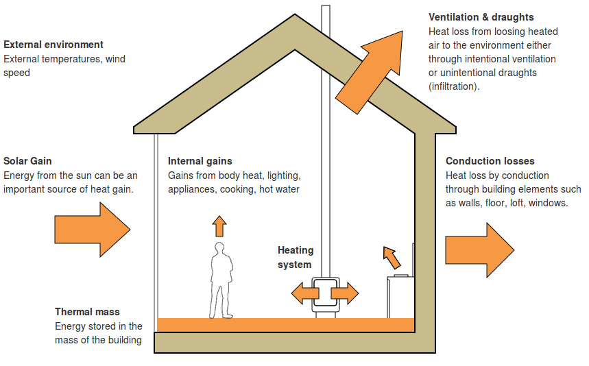

## Modelling building energy performance

The following diagram illustrates the most common factors taken into account in building energy models:

### Part 1: Heat losses

- [Conduction through building fabric](fabricheatloss.md): walls, windows, loft, floor, thermal bridges. Calculated via material U-values or thermal conductivity.
- [Ventilation and Infiltration](ventilation.md)
- [A Simple JavaScript model for calculating heat demand](SimpleJSModel.md)

### Part 2: Internal gains

- Metabolic (body heat)
- Lighting
- Appliances
- Cooking
- Hot water, including solar hot water
- Heating system

### Part 3: Solar gains

### Part 4: Further considerations

- Utilisation factors of gains
- Thermal mass

### Dynamic modelling

- [A simple dynamic building model](https://github.com/emoncms/dynamic/blob/master/docs/dynamicmodel.md)

### Other

- [A simple radiator model](https://github.com/emoncms/dynamic/blob/master/docs/radiatormodel.md)
- [A simple heatpump model](https://github.com/emoncms/dynamic/blob/master/docs/heatpumpmodel.md)

### Model types

**Simple annual**
The simplest of all models, possible to get good insight into energy performance with the least amount of calculations, but not as accurate as more detailed models.

**Simple monthly**
A very common simple model type, used in SAP, more accurate than the annual model and gives insight into seasonal factors throughout a year. Require's higher detail datasets.

**Dynamic simulations**
The simple model's use averaged annual, monthly datasets and so give outputs that are averages for a year/month. Dynamic simulations can give far greater detail and can be useful for finding out what happens in extremes of climate: hour-by-hour on a sunny day in June rather than the average for June.
